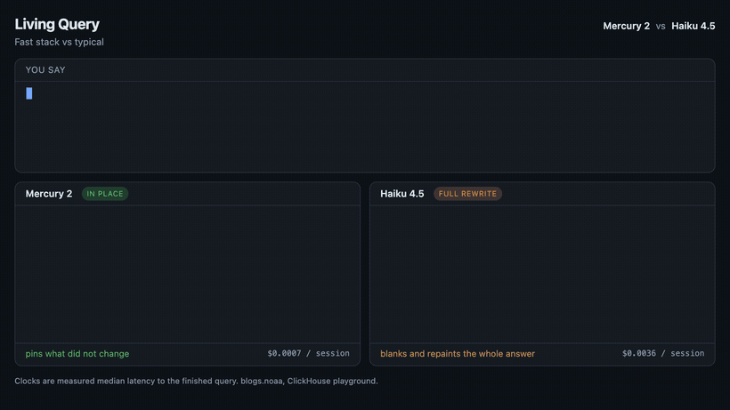

# Living Query

Refine a SQL query in plain English and stay in flow. On the left it reforms in place, pinning the tokens that did not change. On the right it is rewritten from scratch, the way a normal text-to-SQL tool does it — you submit, wait, and re-read a fresh query every time.



*Left: Mercury 2, in place. Right: a typical full-rewrite tool. Same refinements, same data.*

We do not think enough about how much staying in flow matters during data analysis. This is a small trick for it, running over a real benchmark table: `blogs.noaa` on the public [ClickHouse playground](https://clickhouse.com/docs/getting-started/playground), about 1.08 billion rows of global daily weather. The result rows are real.

## Why this is feasible

Two honest points, kept apart so a careful reader can trust the demo.

**Reforming in place is a free, model-agnostic trick.** A SQL query is not built left to right. You add a filter in the middle, change one aggregate, append a column. If you diff each new query against the last and patch only what changed, the query stops flickering and you keep your place. The left panel does exactly this. It needs no special model.

**Doing it continuously is what needs a fast, cheap model.** Regenerating the query on every refinement is only pleasant if regenerating is fast and cheap. That is what [Mercury 2 from Inception Labs](https://www.inceptionlabs.ai/) brings: its diffusion architecture gives it the throughput and low cost to regenerate as fast as you can talk, where an autoregressive model of similar quality would make you wait. Diffusion enables the UX through speed — it is not doing the in-place edit itself. The model-speed control shows this: switch to a typical model and the flow falls apart on both panels.

## The moment to watch

Play the canned demo and watch both panels. They show the same query after the same generation wait. The left patches in place, its stat reading something like `+2 · 79 pinned`, and the result updates with it. The right blanks and repaints the whole answer, its stat reading `66 re-created`. Same query, two render strategies — one keeps you in flow, one does not.

Then flip **Fast model** to **Typical model**. The wait grows on both panels, because latency is a property of the model, not the renderer. On a typical model even the in-place panel has to wait, and the live feel is gone. That is the point: the rendering trick is free, but doing it continuously needs the fast, cheap model.

## Run the canned demo

No key needed. No build step.

```
npm start
```

Open http://localhost:3000. Hit **Play**, or **Step** through one refinement at a time. The left and right panels move together so you can compare them in one glance.

You can also open `index.html` directly from disk for the canned demo. The bundled server is only required for live mode.

## Live mode with your own key

Live mode makes one real call to Mercury per refinement and feeds the same response to both panels. The left diffs it against the previous response and patches in place. The right streams it in from scratch. The measured round-trip latency is shown, so the numbers are real rather than hand-tuned.

This is also the honest test of the first claim. If Mercury returns stable SQL across refinements, the in-place diff stays small and the panel reforms cleanly. If it drifts, the diff grows and you see the limit for yourself.

Get a key from the [Inception platform](https://platform.inceptionlabs.ai). Then either set it in the environment:

```
MERCURY_API_KEY=sk-... npm start
```

Or start the server with no key and paste one into the **Live** panel in the page. The key is sent per request to the bundled proxy and is never written to disk. The proxy exists so the key does not have to live in page state and so browser CORS rules do not block the call.

On the **Live** tab, hit **Play live** to run the scripted prompts through real Mercury, or type your own description in the box. Each refinement is a real model call, and the generated SQL is then executed against `blogs.noaa` on the ClickHouse playground, so the result table is real too. Nothing here is simulated.

## Record your own

The honest way to capture a GIF is from **Live** mode, not canned mode.

1. `npm start`, open the page, switch to **Live**.
2. Paste your Mercury key (or start the server with `MERCURY_API_KEY` set).
3. Hit **Play live** and record. The SQL on both panels is real Mercury output, the latency shown is real, and the result rows are a real ClickHouse query.

Keep the browser tab focused while recording — background tabs throttle timers and stall the animation.

## The data is real

The query runs against `blogs.noaa` on the public, read-only, keyless [ClickHouse playground](https://clickhouse.com/docs/getting-started/playground) — about 1.08 billion rows of global daily weather. In live mode it executes there for real. Canned mode ships the same rows snapshotted, so it stays deterministic and needs no network or key.

## How it works

- `src/diff.js` provides both render primitives. `patchInPlace` tokenizes the SQL, aligns the old and new token lists with a longest-common-subsequence pass, and patches the DOM so unchanged tokens keep their exact node and never move or flash. `streamTokens` displays a query from scratch behind a generation caret, the way a chat tool shows a fresh response.
- `src/app.js` orchestrates both modes. Canned mode plays scripted SQL with illustrative timing; live mode calls Mercury for the SQL and ClickHouse for the result.
- `src/scenes.js` is the canned storyline, with the real snapshotted result rows. Each step adds one line of English and one SQL state. Consecutive states differ by a local edit on purpose.
- `src/live.js` calls the Mercury proxy and strips any code fences from the model output.
- `src/db.js` runs a query against the ClickHouse playground through the proxy and returns columns, rows, and the real elapsed time.
- `server.mjs` is a zero-dependency static server plus two thin proxies — one to the Inception API, one to the keyless ClickHouse playground.

## What this shows, and what it does not

It shows that in-place rendering removes the flicker-and-lose-your-place problem, and that doing it continuously is a question of model throughput.

Canned mode is a scripted illustration — its generation timing is simulated, labeled as such, and there for people without a key. Live mode is real end to end: real Mercury SQL, real latency, real ClickHouse results. Record from live mode.

It only diffs full text on the client. True span pinning would come from the model's own infill, where the model emits the delta and the renderer holds the rest fixed. So the in-place trick depends on the model returning stable text across refinements; if a model reformats its output each turn, a client-side diff cannot keep the query stable. A production build would push the pinning into the model.

Every refinement in the storyline is additive, which flatters the in-place renderer. A refinement that forces a structural rewrite, single table to a join for example, would produce a large diff on both sides. That case is not yet in the storyline.

## Reproduce the article's numbers

The post makes three measurable claims — speed, cost, correctness. Each has a script in `eval/` and a committed result in `eval/results/`. Run them with your own keys.

```
export INCEPTION_API_KEY=...   # or MERCURY_API_KEY
export ANTHROPIC_API_KEY=...   # only for the Haiku / Opus baselines
cd eval
python3 latency.py             # speed
python3 cost.py                # cost
```

**Speed** — `latency.py` runs the six-step storyline through each model on its own native API and reports the median time to a finished query.

| Model | Time to a finished query (one run) |
| --- | --- |
| Mercury 2 | ~0.34 s |
| Haiku 4.5 | ~1.05 s |
| Opus 4.8 | ~2.34 s |

These are one run, committed in `results/latency.json` — yours will differ. Latency drifts with network and time of day, and Anthropic is notably slower in the afternoon, so the article uses a conservative ~1.4 s for Haiku. The stable result is the ratio: Mercury lands a finished query 3x or more faster than Haiku and ~7x faster than Opus.

**Cost** — `cost.py` runs the same storyline, reads the token counts the APIs actually report, and multiplies by published prices. The render strategy is free, so cost is purely a function of the model.

| Model | Cost per six-step session | Sessions per dollar |
| --- | --- | --- |
| Mercury 2 | ~$0.0007 | ~1,460 |
| Haiku 4.5 | ~$0.0039 | ~255 |
| Opus 4.8 | ~$0.0286 | ~35 |

These are each model's real token usage at its own price, so the verbose models cost more than a uniform per-token estimate suggests. Mercury comes out ~6x cheaper than Haiku and ~42x cheaper than Opus.

**Correctness** — `spider_eval.py` scores each model on [Spider 1.0](https://yale-lily.github.io/spider), the standard text-to-SQL benchmark, by execution accuracy. Results are committed in `eval/results/`.

| Model | Spider 1.0 dev | Valid SQL |
| --- | --- | --- |
| Mercury 2 | 73.2% | 99.1% |
| Haiku 4.5 | 73.4% | 99.3% |
| Opus 4.8 | 84.7% | 99.9% |

Mercury matches Haiku on correctness while being faster and cheaper. Opus leads — the frontier premium — at much higher cost and latency. To run it, grab Spider first.

```
cd eval
python3 -m pip install gdown
python3 -m gdown 1TqleXec_OykOYFREKKtschzY29dUcVAQ -O spider.zip
unzip -q spider.zip                                 # creates spider/
python3 spider_eval.py --model gold --limit 1034    # sanity: scorer is 100% on gold
python3 spider_eval.py --model mercury              # then mercury / haiku / opus
```

This is zero-shot and single-call, a deliberately naive setup — production pipelines add schema-linking and self-correction and score higher. Spider runs on SQLite, a proxy for the demo's ClickHouse dialect, not the same thing.

## Recreate the comparison GIFs

The three GIFs in `assets/` are produced deterministically. `film.html` animates each side at its real measured median latency from a virtual clock, so capture has no background-tab throttling and is fully reproducible.

```
npm start                      # one terminal
npm i playwright-core          # drives your installed Chrome, no download
node film/capture.mjs          # writes assets/living-query-*.gif (needs ffmpeg)
```

To just watch film mode live, open http://localhost:3000/film.html?c=1 (or c=2, c=3).

## Files

```
index.html        the page
styles.css         layout, syntax colors, animations
src/app.js         orchestration, canned playback, live mode, Play live
src/diff.js        token diff and in-place DOM patch
src/scenes.js      the canned storyline with real snapshotted result rows
src/schema.js      the blogs.noaa schema, shown to the model
src/live.js        Mercury client via the proxy
src/db.js          ClickHouse playground client via the proxy
server.mjs         static server, Inception proxy, ClickHouse proxy
film.html          deterministic "film" view used to capture the GIFs
src/film.js        the virtual-clock renderer behind film.html
film/capture.mjs   Playwright + ffmpeg pipeline that recreates the GIFs
eval/latency.py    speed proof: time to a finished query, per model
eval/cost.py       cost proof: real token usage and dollars per session
eval/spider_eval.py  correctness proof: Spider 1.0 execution accuracy
eval/results/      committed benchmark results
```

## License

MIT
